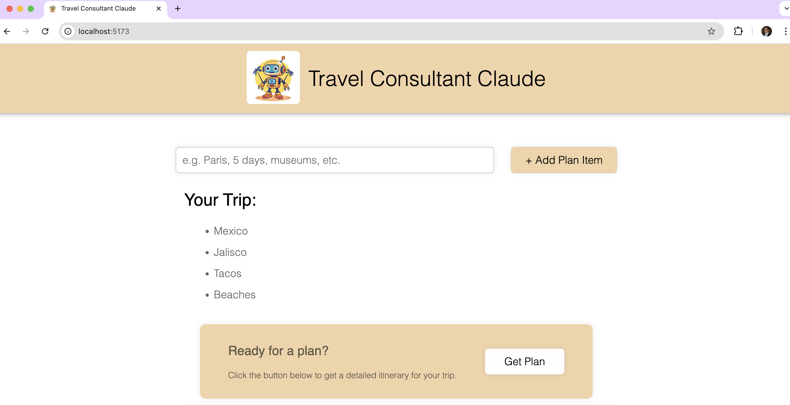
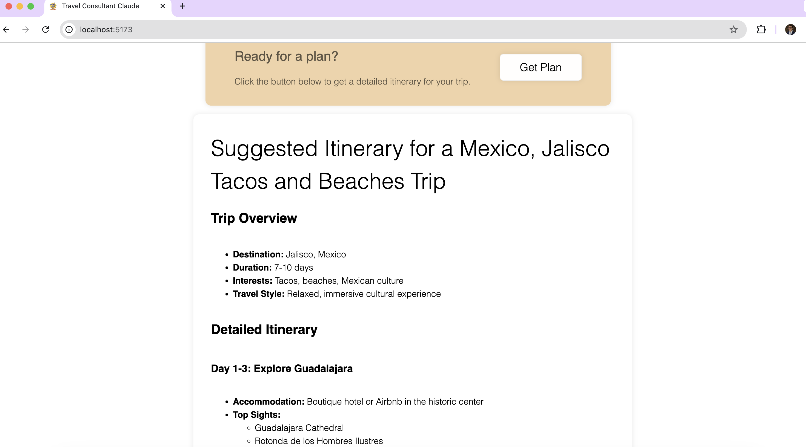

# Travel Consultant Claude

**Travel Consultant Claude** is a simple web application that helps users plan their upcoming vacations by allowing them to input key plan items. It uses the **Anthropic API** for natural language processing to generate a detailed itinerary based on the user's preferences and inputs. The application is built with **React**.

**Deployed using Vercel:** [[https://www.rossviewhawksfootball.com/](https://travel-consultant-claude-git-main-jyoung10078s-projects.vercel.app/)](https://travel-consultant-claude-git-main-jyoung10078s-projects.vercel.app/)




## Features

- Input key vacation items such as destinations, activities, accommodations, and dates.
- Generate a detailed, well-structured vacation itinerary.
- Utilize the **Anthropic API** to process and structure itinerary information.
- User-friendly interface built with React.

## Technologies Used

- **React**: For building the front-end user interface.
- **Anthropic API**: For generating the itinerary based on user input.
- **CSS**: For styling the application.
- **Node.js**: For running the backend server (if applicable).
  
## Prerequisites

Before getting started, ensure you have the following installed:

- **Node.js** (Version 14.x or later)
- **npm** (Node Package Manager)
- A valid API key for the **Anthropic API**

## Installation

1. **Clone the repository** to your local machine:

   ```bash
   git clone https://github.com/jyoung10078/travel-consultant-claude.git
   ```

2. **Navigate to your project directory:**

    ```bash
    cd travel-consultant-claude
    ```

3. **Install Dependencies:***

    ```bash
    npm install
    ```

4. **Create a .env file in the root directory of the project and add your Anthropic API key:**

    ```bash
    REACT_APP_ANTHROPIC_API_KEY=your-api-key-here
    ```

5. **Start the application:**

    ```bash
    npm run dev
    ```
This will launch the app locally on http://localhost:3000

## Usage

1. Upon starting the app, the user will be prompted to input key vacation details, such as:
   - Desired destinations
   - Activities they want to do
   - Accommodation preferences
   - Vacation dates

2. The app will send the information to the **Anthropic API**, which will generate a detailed itinerary based on the inputs.

3. The generated itinerary will be displayed in a readable and structured format for the user to review and plan their trip.

## Contributing

If you'd like to contribute to the development of **Travel Consultant Claude**, follow these steps:

1. **Fork** the repository.
2. Create a new **branch** for your feature or fix.
3. **Make your changes** and test thoroughly.
4. **Commit** your changes with clear, concise commit messages.
5. **Push** your changes to your forked repository.
6. Open a **Pull Request** describing your changes and why they're beneficial.

We welcome all contributions!

## License

This project is licensed under the **MIT License**.

## Contact

If you have any questions or feedback, feel free to reach out:

- GitHub: [https://github.com/jyoung10078](https://github.com/jyoung10078)
- Email: jyoung10078@gmail.com

---

Thank you for using **Travel Consultant Claude**! We hope it makes your vacation planning a breeze.


   
